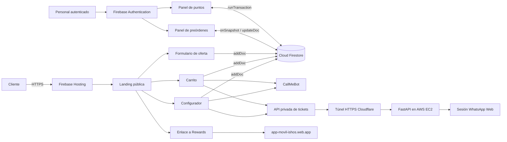
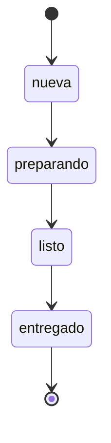
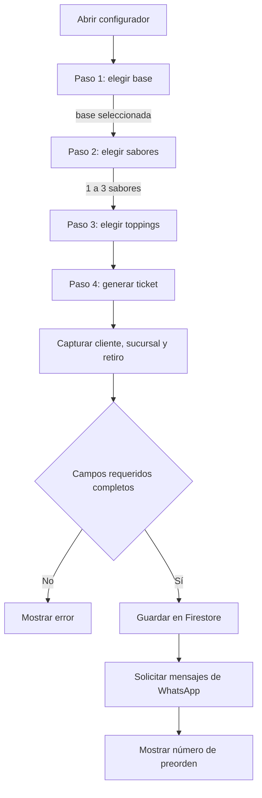
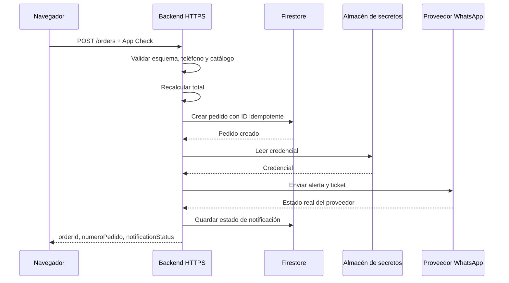

# Arquitectura técnica de Isho's Factory Web

> Estado documentado: 29 de septiembre de 2026  
> Alcance: sitio público, configurador interactivo, preórdenes, panel operativo, Rewards y mensajería de WhatsApp.

## 1. Resumen ejecutivo

Isho's Factory Web es una aplicación web estática desplegada en **Firebase Hosting**. No usa un framework ni un proceso de compilación: la interfaz está construida con HTML, CSS y JavaScript nativo, y consume Firebase desde módulos ES publicados por CDN.

El navegador se conecta directamente a **Cloud Firestore** para registrar leads, preórdenes y datos de Rewards. Los paneles internos utilizan **Firebase Authentication** y listeners en tiempo real de Firestore.

El flujo de preórdenes tiene dos entradas:

1. **Configurador interactivo:** permite elegir una base, hasta tres sabores y toppings.
2. **Carrito de productos:** permite agregar productos prediseñados y modificar cantidades.

Ambos flujos crean un documento en `pedidos` y luego intentan enviar dos mensajes independientes:

- Una alerta interna al negocio mediante **CallMeBot**.
- Un comprobante tipo ticket al cliente mediante una **API privada de WhatsApp alojada en AWS**.

La API privada recibe solamente el teléfono y el contenido del ticket; las credenciales de administración permanecen en el servidor. El pedido se persiste antes de notificar, de modo que una caída temporal de mensajería no elimina la preorden. El sitio sigue en desarrollo y pruebas; muestra un aviso persistente para comunicarlo a las personas visitantes.

## 2. Vista general



## 3. Tecnologías

| Capa | Tecnología | Uso |
|---|---|---|
| Presentación | HTML5 y CSS3 | Landing, modales, tickets y paneles |
| Lógica cliente | JavaScript nativo | Configurador, carrito, validaciones y llamadas HTTP |
| Iconografía | Font Awesome | Iconos de interfaz |
| Persistencia | Cloud Firestore | Leads, pedidos, usuarios, puntos y canjes |
| Identidad | Firebase Authentication | Acceso del personal a paneles internos |
| Hosting | Firebase Hosting | Publicación de archivos dentro de `public/` |
| Mensajería interna | CallMeBot | Aviso de nueva preorden al negocio |
| API de tickets | FastAPI + Playwright | Envío del ticket mediante una sesión de WhatsApp Web |
| Infraestructura de tickets | AWS EC2 + Cloudflare Tunnel | Ejecución persistente y acceso HTTPS a la API |
| Escaneo | html5-qrcode | Lectura del QR de Rewards en caja |

No hay `package.json`, bundler, framework ni backend propio dentro de este repositorio.

## 4. Estructura del repositorio

```text
ishos/
├── firebase.json                 # Hosting y ruta de reglas
├── firestore.rules              # Autorización y validación de Firestore
├── README.md                     # Inicio rápido
├── docs/
│   └── ARQUITECTURA.md           # Este documento
└── public/
    ├── index.html                # Landing, configurador, carrito y mensajería
    ├── styles.css                # Estilos globales de la landing
    ├── script.js                 # Script auxiliar/legado
    ├── pedidos/index.html        # Panel operativo de preórdenes
    ├── puntos/index.html         # Panel interno de Rewards
    ├── leads/index.html          # Administración de cupones/leads
    ├── datos/index.html          # Vista de datos
    ├── images/                   # Recursos gráficos
    └── logo.*                    # Identidad visual
```

Firebase Hosting sirve `public/` como raíz. Por tanto:

| Archivo | Ruta pública esperada |
|---|---|
| `public/index.html` | `/` |
| `public/pedidos/index.html` | `/pedidos/` |
| `public/puntos/index.html` | `/puntos/` |
| `public/leads/index.html` | `/leads/` |

## 5. Componentes funcionales

### 5.1 Landing pública

`public/index.html` reúne la mayor parte de la experiencia pública:

- Selección inicial de sucursal, persistida en `localStorage`.
- Menú de productos.
- Historia y ubicaciones.
- Configurador interactivo.
- Carrito y checkout.
- Formulario de descuento.
- Promoción y acceso a Isho's Rewards.
- Integración con Firestore y proveedores de WhatsApp.
- Aviso global de sitio en desarrollo y pruebas.

La selección de sucursal usa las claves locales:

- `ishos_sucursal`: sucursal elegida.
- `ishos_sucursal_omitida`: indica que el modal fue omitido durante la sesión.

### 5.2 Panel de preórdenes

`public/pedidos/index.html` es el panel operativo para preparar y entregar pedidos. Sus responsabilidades principales son:

- Iniciar sesión mediante Firebase Authentication.
- Escuchar `pedidos` en tiempo real con `onSnapshot`.
- Filtrar por sucursal.
- Separar pedidos por estado.
- Calcular tiempos aproximados de retiro.
- Reproducir una alerta opcional al detectar una nueva preorden.
- Actualizar el estado y `actualizado_en`.

El ciclo actual es:



### 5.3 Panel de Rewards

`public/puntos/index.html` permite que el personal:

- Busque al cliente por código corto o QR.
- Consulte puntos, nivel y datos básicos.
- Acredite puntos.
- Registre la sucursal y el detalle de la compra.
- Actualice puntos, nivel y visitas dentro de una transacción atómica.
- Cree el movimiento correspondiente en `transactions`.

El cálculo de nivel es:

| Nivel | Puntos mínimos |
|---|---:|
| Bronce | 0 |
| Plata | 100 |
| Oro | 300 |
| Diamante | 600 |

La aplicación pública de Rewards se encuentra en `https://app-movil-ishos.web.app/` y la landing enlaza hacia ella.

## 6. Configurador interactivo de sorbetes

### 6.1 Estado en memoria

El configurador mantiene un objeto `state` dentro de un listener `DOMContentLoaded`:

```js
{
  currentStep: 1,
  base: null,
  basePrice: 0,
  baseIcon: 'fa-ice-cream',
  flavors: [],
  flavorPrices: {},
  flavorIcons: {},
  toppings: [],
  toppingPrices: {},
  orderNum: null,
  total: 0
}
```

El estado vive únicamente en el navegador. Si la página se recarga antes de confirmar, la selección se pierde.

### 6.2 Flujo de interacción



#### Paso 1: base

- Solo puede existir una base seleccionada.
- El precio se obtiene de `data-price` en la tarjeta HTML.
- La selección habilita el avance al paso 2.

#### Paso 2: sabores

- Se exige al menos un sabor.
- Se permiten como máximo tres.
- Al alcanzar el límite, las opciones restantes reciben la clase `disabled`.
- La previsualización se actualiza en tiempo real con un sorbete construido en CSS: cambia la base, muestra de una a tres bolas con colores asociados a los sabores y representa los toppings elegidos.
- La previsualización también se adapta a pantallas móviles.

#### Paso 3: toppings

- Son opcionales.
- No existe un máximo configurado.
- Cada selección agrega su precio al total.

#### Paso 4: ticket

- `generateTicket()` crea un número aleatorio entre 1000 y 9999.
- Renderiza base, sabores, toppings, total y fecha.
- Solicita nombre, teléfono, sucursal y tiempo estimado de retiro.

### 6.3 Cálculo del total

La fórmula implementada es:

```text
total = precioBase
      + suma(precioDeCadaSabor)
      + suma(precioDeCadaTopping)
```

Los catálogos están declarados en `public/index.html`:

- `BASE_NAMES`
- `FLAVOR_NAMES` y `FLAVOR_PRICES`
- `TOPPING_NAMES` y `TOPPING_PRICES`

Los precios se presentan con dos decimales mediante `toFixed(2)`.

### 6.4 Persistencia de la preorden

Al confirmar, el configurador crea un documento en `pedidos` con la estructura siguiente:

```js
{
  numero_pedido: 1234,
  nombre: 'Cliente',
  whatsapp: '70000000',
  base: 'Vaso Grande',
  sabores: ['Mango con Chile', 'Fresa Natural'],
  toppings: ['Granola'],
  sucursal: 'Parque Los Pinitos',
  retiro: '30 minutos',
  total: 5.25,
  estado: 'nueva',
  origen: 'configurador',
  fecha: serverTimestamp()
}
```

El pedido se guarda antes de intentar las notificaciones. Por eso una falla de WhatsApp no elimina la preorden.

### 6.5 Riesgos conocidos del configurador

1. **Número no único:** el número de cuatro dígitos es aleatorio y puede repetirse. El ID de Firestore sí es único, pero no se muestra al cliente.
2. **Precios controlados por el cliente:** los importes viven en HTML/JavaScript y pueden modificarse desde el navegador.
3. **Validación telefónica mínima:** se comprueba que el campo no esté vacío, pero no su longitud o país.
4. **Sin idempotencia:** un doble envío o reintento puede crear dos documentos.
5. **Estado no persistido:** una recarga elimina la selección sin confirmar.
6. **HTML dinámico:** algunos fragmentos se construyen con `innerHTML`; los catálogos son internos, pero conviene mantener datos del usuario fuera de estas plantillas.

## 7. Carrito de productos

El carrito es un objeto en memoria indexado por el nombre del producto:

```js
cart[nombre] = { price, qty };
```

Permite agregar, quitar y modificar cantidades. El checkout solicita los mismos datos operativos que el configurador y crea un documento compatible en `pedidos`:

- `base` se guarda como `Pedido directo`.
- `sabores` contiene únicamente los nombres de producto; las cantidades solo aparecen en el mensaje y actualmente no se persisten.
- `toppings` es un arreglo vacío.
- No se guarda `origen`; el panel identifica este flujo comprobando si `base === 'Pedido directo'`.
- `total` se guarda como texto mediante `toFixed(2)`, a diferencia del configurador, que lo guarda como número.

Además del checkout, la interfaz conserva un enlace `wa.me` para que el usuario pueda abrir una conversación manual con el negocio.

La pérdida de cantidades y la diferencia de tipo en `total` son incompatibilidades del esquema actual que conviene corregir durante la migración al backend.

## 8. Integración de WhatsApp

### 8.1 Responsabilidades

La función compartida `notificarPedido()` recibe:

```js
{
  mensajeAdmin,
  telefonoCliente,
  mensajeCliente
}
```

Luego realiza dos solicitudes en paralelo mediante `Promise.allSettled()`:

| Destino | Proveedor | Objetivo |
|---|---|---|
| Negocio | CallMeBot | Avisar que entró una preorden |
| Cliente | API privada en AWS mediante túnel HTTPS | Enviar el comprobante tipo ticket |

Los envíos son independientes: si uno falla, el otro puede continuar.

### 8.2 Notificación interna con CallMeBot

El navegador construye una solicitud GET equivalente a:

```text
https://api.callmebot.com/whatsapp.php
  ?source=web
  &phone=<NUMERO_EMISOR_O_DESTINO>
  &apikey=<API_KEY>
  &text=<MENSAJE_CODIFICADO>
```

El mensaje administrativo incluye cliente, teléfono, número de ticket, sucursal, retiro y total.

### 8.3 Ticket al cliente mediante la API privada

El navegador envía un `POST` JSON al endpoint HTTPS `/ticket` de la API:

```text
POST https://<TUNEL_HTTPS>/ticket
Content-Type: application/json

{
  "telefono": "+50370000000",
  "texto": "<TICKET>"
}
```

El túnel termina HTTPS y reenvía la solicitud a FastAPI en `127.0.0.1:8000` dentro de una instancia EC2. La aplicación y el túnel se ejecutan como servicios administrados por `systemd`, configurados para reiniciarse ante una caída. FastAPI valida teléfono y tamaño del mensaje, limita cada dirección a cinco solicitudes por minuto y serializa los envíos para evitar que dos pedidos controlen la misma sesión de WhatsApp simultáneamente.

El servidor conserva además rutas operativas:

| Ruta | Acceso | Finalidad |
|---|---|---|
| `POST /ticket` | Público con CORS limitado | Solicitar el ticket del cliente |
| `GET /health` | Público | Comprobar disponibilidad del servicio |
| `GET /enviar` | Clave administrativa | Prueba y envío manual controlado |
| `GET /captura` | Clave administrativa | Consultar la captura operativa de WhatsApp |

La aplicación solo escucha en `127.0.0.1:8000`; no expone el puerto de FastAPI directamente a internet. El túnel HTTPS es la única entrada pública prevista.

El teléfono se normaliza con `normalizarTelefonoWhatsApp()`:

1. Elimina caracteres que no sean dígitos.
2. Elimina el prefijo internacional `00`, si existe.
3. Agrega `503` cuando el valor no comienza por ese prefijo.
4. Devuelve el número con `+`.

Ejemplo:

```text
Entrada:  7000-0000
Salida:   +50370000000
```

Esta lógica está diseñada para números salvadoreños. No identifica correctamente todos los números internacionales.

### 8.4 Formato del ticket

El ticket del configurador contiene:

- Marca y título `COMPROBANTE DE PREORDEN`.
- Número de preorden.
- Nombre del cliente.
- Sucursal y retiro.
- Base, sabores y toppings.
- Total.
- Aviso de pago al retirar.
- Instrucción para presentar el número en caja.

El carrito utiliza un formato equivalente, sustituyendo la personalización por las líneas de productos y cantidades.

### 8.5 Tolerancia a fallos actual

- La notificación interna conserva un timeout de 12 segundos y `mode: 'no-cors'`.
- El ticket al cliente usa un timeout de 30 segundos en el navegador.
- La respuesta de la API privada se valida; un HTTP no exitoso se trata como fallo.
- Los rechazos se escriben en la consola sin registrar la clave privada.
- El pedido permanece guardado aunque el proveedor falle.

Para el ticket, `ticketSolicitado: true` indica que la función obtuvo una respuesta HTTP exitosa
del servicio de AWS. No garantiza por sí solo que WhatsApp haya entregado el mensaje; esa garantía
depende de lo que reporte la API privada.

### 8.6 Restricción operativa detectada

La API de AWS se publica temporalmente mediante un túnel rápido de Cloudflare. Si el servicio del
túnel se recrea, la URL puede cambiar; para producción conviene sustituirlo por un túnel con nombre
y dominio estable.

Esta es la principal dependencia operativa actual: una URL nueva exige actualizar `ISHOS_TICKET_API_URL` en `public/index.html` y volver a desplegar Firebase Hosting. Un dominio propio con un túnel nombrado elimina ese paso manual.

### 8.7 Seguridad de las credenciales

El endpoint público `/ticket` no recibe la clave administrativa. La clave solo protege los endpoints
manuales del servidor. La credencial restante de CallMeBot continúa en el frontend y debe considerarse pública.

Acciones prioritarias:

1. Rotar las claves actuales.
2. No guardar nuevas claves en HTML, JavaScript público ni Git.
3. Mover también la notificación interna de CallMeBot al backend.
4. Añadir una validación del identificador de pedido además del límite por dirección IP.
5. Registrar el resultado del proveedor sin guardar secretos ni el mensaje completo en logs.

### 8.8 CORS y respuesta al cliente

El backend permite solicitudes únicamente desde los dominios de Firebase Hosting y desde los orígenes locales de desarrollo autorizados. El navegador aplica un timeout de 30 segundos al ticket; si la API devuelve un estado no exitoso o un JSON con `ok: false`, se registra el fallo en consola y la preorden se conserva en Firestore.

Una respuesta `ok: true` confirma que la API aceptó y procesó la solicitud de envío; no equivale a una confirmación final de entrega de WhatsApp.

## 9. Modelo de datos de Firestore

### 9.1 `pedidos`

| Campo | Tipo | Descripción |
|---|---|---|
| `numero_pedido` | number | Número visible de cuatro dígitos |
| `nombre` | string | Nombre del cliente |
| `whatsapp` | string | Teléfono ingresado |
| `base` | string | Base elegida o `Pedido directo` |
| `sabores` | array<string> | Sabores o productos |
| `toppings` | array<string> | Toppings seleccionados |
| `sucursal` | string | Sucursal de retiro |
| `retiro` | string | Tiempo solicitado |
| `total` | number \| string | Número desde el configurador; texto decimal desde el carrito |
| `estado` | string | `nueva`, `preparando`, `listo` o `entregado` |
| `origen` | string opcional | Actualmente solo lo guarda el configurador |
| `fecha` | timestamp | Creación en servidor |
| `actualizado_en` | timestamp | Último cambio de estado |

### 9.2 `leads`

Almacena los registros del formulario de descuento, incluyendo datos de contacto, sabor favorito, código y estado de canje.

### 9.3 `users`

Perfiles de Rewards. Incluye identidad, código Rewards, puntos, nivel, visitas y fecha de actualización.

### 9.4 `transactions`

Historial inmutable de movimientos de Rewards:

```js
{
  userId,
  type: 'earn' | 'redeem',
  points,
  description,
  branch,
  source,
  awardedBy,
  awardedByEmail,
  createdAt
}
```

### 9.5 `redemptions`

Registra canjes iniciados por el propietario de la cuenta Rewards.

## 10. Autenticación y reglas de seguridad

Las funciones auxiliares de `firestore.rules` son:

- `signedIn()`: existe una sesión de Firebase.
- `owns(userId)`: el UID coincide con el documento del usuario.
- `isStaff()`: correo autorizado o custom claim `admin`/`staff`.
- `levelFor(points)`: calcula el nivel de Rewards.

### Permisos actuales

| Colección | Crear | Leer | Actualizar | Eliminar |
|---|---|---|---|---|
| `leads` | Público | Público | Público | Denegado |
| `pedidos` | Público | Público | Usuario autenticado | Denegado |
| `users` | Propietario | Propietario o staff | Según reglas de puntos | Denegado |
| `transactions` | Staff/propietario según tipo | Staff o propietario | Denegado | Denegado |
| `redemptions` | Propietario | Staff o propietario | Denegado | Denegado |

### Hallazgos de seguridad

Los siguientes puntos deben corregirse antes de considerar la aplicación lista para producción:

1. `leads` permite lectura y actualización sin autenticación; expone datos personales y permite alterar cupones.
2. `pedidos` permite lectura pública; expone nombres, teléfonos y detalles de compra.
3. `pedidos` permite creación pública sin validar campos, tipos, importes o límites; facilita spam y manipulación de precios.
4. Cualquier usuario autenticado puede actualizar un pedido; debería exigirse `isStaff()` y limitarse a `estado`/`actualizado_en`.
5. No se observa Firebase App Check.
6. Las reglas no sustituyen la validación de precios en un backend confiable.

Firebase recomienda utilizar Authentication, reglas específicas y validación de datos para los SDK web/móvil, además de probar las reglas con Emulator Suite antes de desplegarlas.

## 11. Arquitectura recomendada



### Contrato sugerido para crear una preorden

```http
POST /api/orders
Content-Type: application/json
Idempotency-Key: <UUID>
```

```json
{
  "customer": {
    "name": "Cliente",
    "phone": "+50370000000"
  },
  "branch": "Parque Los Pinitos",
  "pickup": "30 minutos",
  "origin": "configurador",
  "items": {
    "base": "vaso-g",
    "flavors": ["mango", "fresa"],
    "toppings": ["granola"]
  }
}
```

El backend debe recibir identificadores de catálogo, no precios proporcionados por el navegador. Después debe consultar un catálogo confiable o constantes del servidor y recalcular el total.

### Campos recomendados adicionales en `pedidos`

```js
{
  publicOrderNumber: 'A7K4P2',
  notification: {
    admin: { status: 'sent', providerId: '...' },
    customer: { status: 'failed', errorCode: 'PLAN_LIMIT' }
  },
  idempotencyKey: '...',
  schemaVersion: 2
}
```

No debe guardarse el API key, la URL completa con credenciales ni información sensible innecesaria.

## 12. Manejo de errores esperado

| Escenario | Comportamiento actual | Comportamiento recomendado |
|---|---|---|
| Firestore falla | No se envía WhatsApp; se muestra error | Igual, con código rastreable |
| WhatsApp falla | Pedido permanece guardado | Reintento en backend con límite |
| Proveedor responde 4xx/5xx | No puede leerse por `no-cors` | Guardar respuesta normalizada |
| Doble clic/reintento | Puede duplicar pedido | Idempotency key |
| Precio manipulado | Se acepta desde el cliente | Recalcular en backend |
| Número repetido | Posible colisión | Generador único/contador seguro |

## 13. Operación local y despliegue

### Vista previa local simple

```bash
python3 -m http.server 4173 --directory public
```

Abrir `http://localhost:4173/`.

### Emuladores de Firebase

Para validar reglas y comportamiento de Firestore, conviene configurar Firebase Emulator Suite y ejecutar pruebas automatizadas antes de desplegar.

### Despliegue

```bash
firebase deploy --only hosting
firebase deploy --only firestore:rules
```

La segunda orden reemplaza las reglas activas por las definidas en `firestore.rules`; deben probarse antes de publicarlas.

### Operación de la API de tickets

La API no se despliega con Firebase. Vive en AWS EC2 y su código operativo está fuera de este repositorio, en el directorio del servicio de WhatsApp. Para una revisión operativa se debe comprobar, sin revelar secretos:

```bash
sudo systemctl status ishos-whatsapp
sudo systemctl status ishos-tunnel
curl -fsS https://<TUNEL_HTTPS>/health
```

Si el túnel rápido cambia de URL, hay que actualizar la constante pública de la landing y desplegar Hosting. No se deben abrir ni publicar las rutas administrativas sin su clave.

## 14. Estrategia mínima de pruebas

### Configurador

- No permite avanzar sin base.
- No permite avanzar sin sabores.
- Limita sabores a tres.
- Suma y resta precios correctamente.
- Permite cero o varios toppings.
- Mantiene sincronizados resumen y ticket.
- Bloquea confirmación con datos incompletos.
- Crea exactamente un pedido.

### Firestore

- Un visitante puede crear únicamente un pedido con esquema válido.
- Un visitante no puede listar pedidos ni leads.
- Solo staff puede cambiar estados.
- El cliente Rewards solo puede leer su perfil.
- Una acreditación de puntos crea usuario actualizado y transacción en forma atómica.

### WhatsApp

- Normalización de número local con y sin guion.
- Rechazo de longitudes inválidas.
- Timeout controlado.
- Registro de error sin exponer credenciales.
- Reintentos limitados y sin duplicar mensajes.
- Confirmación basada en respuesta real del proveedor.
- `POST /ticket` acepta el origen público autorizado y rechaza un origen ajeno.
- `/health` informa que la API está disponible sin revelar información de la sesión.
- El servidor reinicia correctamente la aplicación y el túnel.

## 15. Prioridades técnicas

### P0 — Seguridad

1. Rotar y retirar las claves de WhatsApp del frontend.
2. Cerrar lectura pública de `pedidos` y `leads`.
3. Restringir actualizaciones de pedidos a staff.
4. Validar el esquema de creación de pedidos.
5. Reemplazar el túnel rápido por un túnel nombrado y dominio estable.

### P1 — Fiabilidad

1. Crear backend/Cloud Function para pedidos y WhatsApp.
2. Recalcular precios en servidor.
3. Implementar idempotencia.
4. Sustituir el número aleatorio de cuatro dígitos.
5. Guardar estados reales de notificación.

### P2 — Mantenibilidad

1. Separar JavaScript de `index.html` en módulos.
2. Centralizar configuración y catálogo.
3. Agregar pruebas del configurador y reglas.
4. Definir ambientes de desarrollo y producción.
5. Añadir monitoreo de errores y métricas operativas.

## 16. Referencias

- [Firebase Hosting](https://firebase.google.com/docs/hosting)
- [Cloud Firestore](https://firebase.google.com/docs/firestore)
- [Firebase Security Rules](https://firebase.google.com/docs/rules)
- [Condiciones en reglas de Firestore](https://firebase.google.com/docs/firestore/security/rules-conditions)
- API privada de WhatsApp de Isho's Factory: `https://receptors-telling-knew-florists.trycloudflare.com/docs`
- [CallMeBot: API de WhatsApp](https://www.callmebot.com/blog/free-api-whatsapp-messages/)

---

Este documento describe el código existente; no implica que las credenciales, reglas o proveedores actuales sean adecuados para producción.
